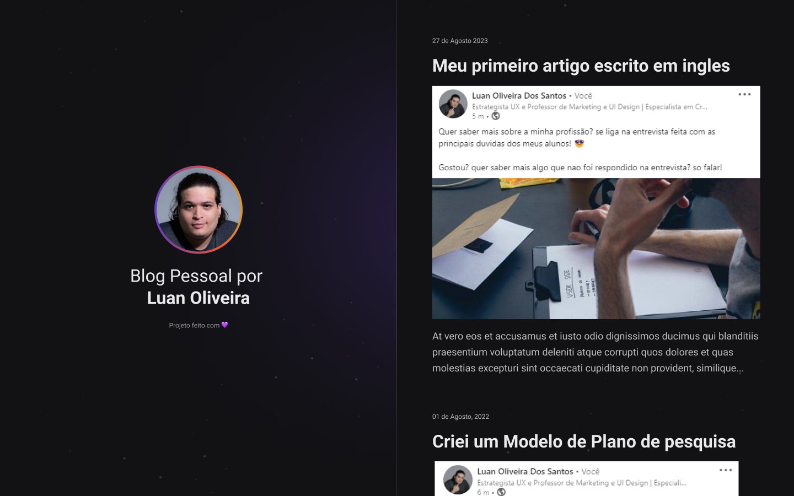

 

## 🖥️ Projeto 
Esse é um projeto Web Responsivo de uma cápsula do tempo para exibit memórias em uma linha do tempo

### 🔎 Tecnologias
Esse projeto foi desenvolvido durante o NLW da Rocketseat com as seguintes tecnologias:

- HTML
- CSS
- Git e Github

## 🎨 Layout
Você pode visualizar o layout do projeto através
[desse link](https://www.figma.com/file/VJSBvvg9KY8VMQbq7lFTLS/C%C3%A1psula-do-tempo-%E2%80%A2-Trilha-Explorer-(Community)-(Copy)?type=design&node-id=352%3A8&mode=design&t=4Xc7EndqTVZNDfp6-1).
É necessario ter uma conta no [Figma](https://www.figma.com).
